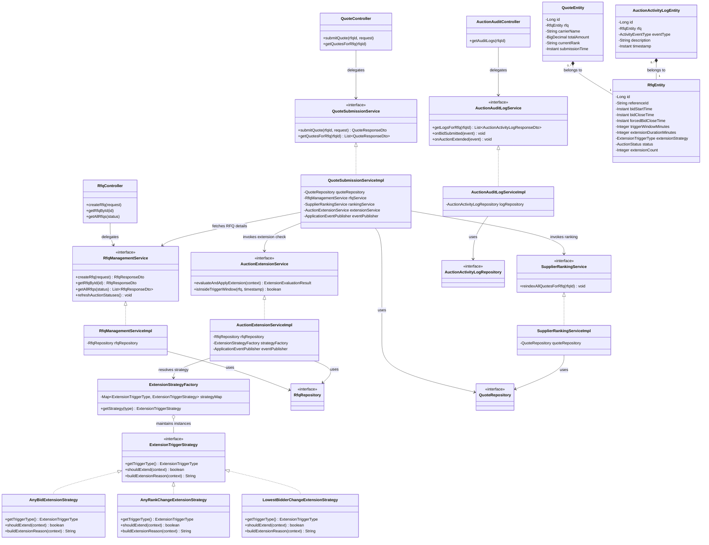

# Low Level Design (LLD)

The following diagram illustrates the low-level object-oriented architecture of the British Auction system. It highlights the relationships between Controllers, Services, the Database (Repositories/Entities), and the Strategy Pattern implementation for dynamic auction extensions.

