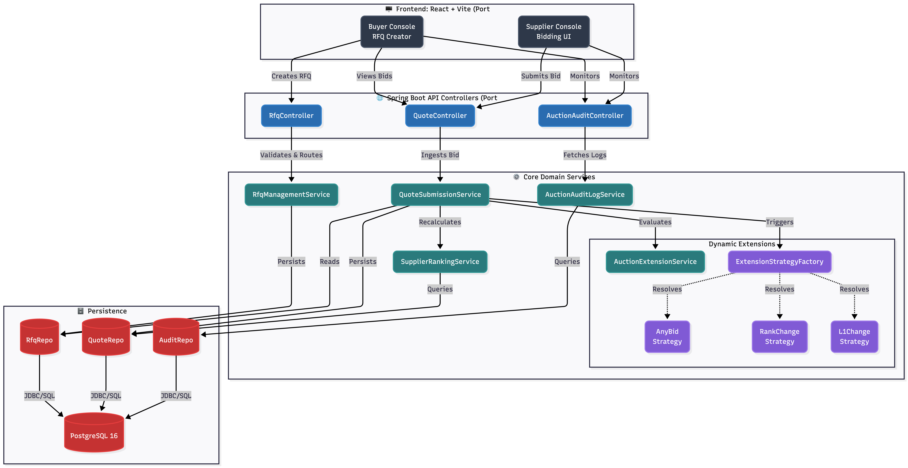
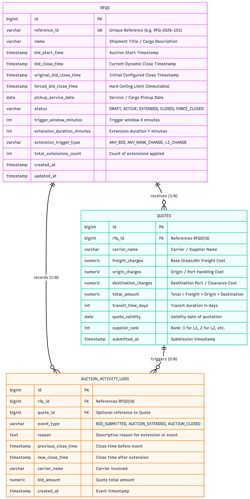

# Request for Quotation (RFQ) - British Auction System

A full-stack, enterprise-grade **Request for Quotation (RFQ) System** utilizing **British Auction** mechanics to combat last-second bidding (sniping) in logistics and freight procurement.

This system allows Buyers (shippers) to provision auctions for freight routes, while Suppliers (carriers) compete to offer the lowest total charge. The platform dynamically extends the auction clock if a bid is placed near the deadline, based on configurable anti-sniping strategies.

---

## 🚀 Technology Stack

- **Backend:** Java 17, Spring Boot 3.3.3, Spring Data JPA, OpenAPI (Swagger)
- **Frontend:** React 18, TypeScript, Vite, custom deep-space glassmorphism UI
- **Database:** PostgreSQL 16 (production/Docker) & H2 (in-memory/testing)

---

## 📁 Project Structure

The repository is structured as a monorepo containing both the Spring Boot backend and the React frontend.

```text
GO_COMET_ASSIGNEMENT/
├── backend/                              # Spring Boot Application
│   ├── src/main/java/com/gocomet/auction/
│   │   ├── config/                       # OpenAPI/Swagger & WebMvc config
│   │   ├── controller/                   # REST API Endpoints (RFQ, Quotes, Audit)
│   │   ├── dto/                          # Data Transfer Objects & Event payloads
│   │   ├── entity/                       # JPA Entities (Rfq, Quote, AuditLog)
│   │   ├── enums/                        # Constants and Status Enums
│   │   ├── event/                        # Spring ApplicationEvents (Observer Pattern)
│   │   ├── exception/                    # Global Exception Handlers
│   │   ├── factory/                      # Factory Pattern (ExtensionStrategyFactory)
│   │   ├── repository/                   # Spring Data JPA Repositories
│   │   ├── service/                      # Core Business Logic & Calculations
│   │   └── strategy/                     # Strategy Pattern implementations
│   ├── src/main/resources/
│   │   ├── application.yml               # Application configuration
│   │   └── schema.sql                    # Database Initialization (H2/Postgres)
│   ├── src/test/                         # JUnit & Mockito Unit Tests
│   ├── pom.xml                           # Maven Dependencies
│   └── docker-compose.yml                # Postgres Docker configuration
│
├── frontend/                             # React Web Application
│   ├── src/
│   │   ├── api/                          # Axios API Client integrations
│   │   ├── components/                   # Reusable UI Components (Modals, Timers, Dashboard)
│   │   ├── styles/                       # CSS (Variables, Components, Globals)
│   │   ├── types/                        # TypeScript Interfaces
│   │   └── utils/                        # Formatting and Date utilities
│   ├── package.json                      # NPM Dependencies
│   └── vite.config.ts                    # Vite Configuration
│
├── HLD.png                               # High Level Design Architecture Diagram
├── DATABASE_SCHEMA.png                   # Database Entity-Relationship Diagram
└── README.md                             # Project Documentation
```

---

## 🏗️ High-Level Design (HLD) & Architecture

The system uses a clean, multi-layered architecture separating presentation, API routing, business logic, and persistence. The backend heavily utilizes event-driven mechanisms to decouple core transaction ingestion from logging.



---

## 🗄️ Database Schema Design

The persistence layer uses a strict relational design with foreign key constraints to maintain data integrity.



---

## 🛠️ How to Run Locally

### Prerequisites
- Java 17
- Node.js 18+
- Docker (Optional, if using PostgreSQL)
- Maven

### 1. Database Setup

You can run the application with either a robust **PostgreSQL** database (via Docker) or an embedded in-memory **H2** database.

**Option A: PostgreSQL via Docker (Recommended for production emulation)**
Run this specific Docker command to spin up a Postgres 16 instance with the correct credentials:
```bash
docker run -d --name auction-postgres \
  -p 5432:5432 \
  -e POSTGRES_USER=postgres \
  -e POSTGRES_PASSWORD=postgrespassword \
  -e POSTGRES_DB=auction_db \
  postgres:16
```
*(Alternatively, you can just run `docker compose up -d` in the `backend/` directory).*

**Option B: In-Memory H2 Database (For quick testing)**
No installation required. When starting the backend in Step 2, simply append the `h2` active profile flag. The H2 console will be accessible at `http://localhost:8080/h2-console` (JDBC URL: `jdbc:h2:mem:auction_db`).

### 2. Start the Backend (Spring Boot)
Open a new terminal and navigate to the `backend` directory:
```bash
cd backend
export JAVA_HOME="/opt/homebrew/opt/openjdk@17" # Replace with your Java 17 path if needed
export PATH="$JAVA_HOME/bin:$PATH"

mvn clean install

# If using PostgreSQL (Default Profile):
mvn spring-boot:run

# If using H2 Database (In-Memory Profile):
mvn spring-boot:run -Dspring-boot.run.profiles=h2
```
- **REST API Base URL:** `http://localhost:8080/api/v1/rfqs`
- **Swagger UI (Interactive API Docs):** `http://localhost:8080/swagger-ui.html`

### 3. Start the Frontend (React + Vite)
Open another terminal and navigate to the `frontend` directory:
```bash
cd frontend
npm install
npm run dev
```
- **Web Dashboard:** `http://localhost:5173/`

---

## 📖 Design Patterns Used

1. **Strategy Pattern (`ExtensionTriggerStrategy`):** Determines *when* an auction should be extended. Adheres strictly to the Open/Closed Principle (OCP), allowing new trigger rules (like `AnyBidExtensionStrategy` or `LowestBidderChangeExtensionStrategy`) to be added without modifying the core bidding logic.

2. **Factory Pattern (`ExtensionStrategyFactory`):** Centralizes the creation and resolution of the correct strategy implementation based on the RFQ's configuration (`ExtensionTriggerType`). It dynamically provides the service layer with the exact strategy needed at runtime.

3. **Observer Pattern (`ApplicationEventPublisher`):** Decouples the core quote ingestion from secondary background actions (like evaluating time extensions or writing persistent audit logs). When a bid is ingested, a `BidSubmittedEvent` is emitted and consumed asynchronously by listeners.

4. **Builder Pattern (`@Builder` via Lombok):** Used extensively across all DTOs (Data Transfer Objects), Request/Response objects, and Entities (like `RfqEntity.builder().build()`). This allows for clean, fluent, and immutable object construction without relying on telescoping constructors.

---

## 📐 SOLID Principles Applied

The backend architecture rigorously adheres to the five core principles of object-oriented design:

1. **Single Responsibility Principle (SRP):** Every class has a strictly defined, single job. For instance, `SupplierRankingService` is only responsible for calculating carrier ranks, `AuctionAuditLogService` strictly writes immutable logs, and `RfqManagementService` handles the broader auction lifecycle state.

2. **Open/Closed Principle (OCP):** The extension evaluation engine is completely open for extension but closed for modification. If a new business requirement mandates a new rule (e.g., *extend only if bid drops by 10%*), a new strategy can be added without modifying a single line of `AuctionExtensionService`.

3. **Liskov Substitution Principle (LSP):** Any concrete implementation of `ExtensionTriggerStrategy` can be dynamically substituted by the `ExtensionStrategyFactory` at runtime without altering the correctness or flow of the core program.

4. **Interface Segregation Principle (ISP):** Instead of bloated interfaces, the application relies on focused, purpose-specific Spring Data interfaces (`QuoteRepository`, `RfqRepository`) keeping the persistence contracts tight and clean.

5. **Dependency Inversion Principle (DIP):** High-level modules (like `RfqController`) do not depend on low-level modules. Instead, they depend entirely on abstractions or injected beans via Spring's IoC container (Constructor Injection). *Note: The Service layer was recently flattened to use concrete classes for simplicity and to remove boilerplate, but can be easily abstracted back into interfaces if multiple implementations are required.*

---

## ⚖️ Architectural Trade-offs

The system purposefully utilizes two different communication patterns, balancing complexity with scale:

1. **Direct Method Calls (Tight Coupling):** Used for low-frequency, administrative tasks like RFQ Creation (`RfqManagementService`). This provides maximum readability and simplicity where performance isn't a bottleneck.

2. **In-Memory Events (Loose Coupling):** Used for high-frequency, complex tasks like Bidding (`QuoteSubmissionService`) via Spring's `ApplicationEventPublisher`. This cleanly decouples core bidding logic from side-effects (like Audit Logging), keeping the critical path fast and modular.

3. **Message Brokers:** If the application scales to a true Microservices architecture, the in-memory events can be easily swapped for an Apache Kafka or RabbitMQ publisher, allowing components like the Audit Log to run on entirely separate servers.

---

## 🔮 Future Scope & Enhancements

While the core British Auction engine is highly functional, the platform is designed to scale with the following future enhancements:

1. **Reintroducing Service Interfaces:** The current architecture uses a flattened service layer (concrete classes only) for simplicity and reduced boilerplate. If the system scales to require multiple implementations for services (e.g., distinguishing between different types of auctions like Dutch vs British), re-introducing `*Service` interfaces back into the architecture will be a beneficial next step.

2. **Role-Based Authentication (Spring Security + JWT):** Enforcing strict access controls where only authenticated Buyers can create RFQs, and authenticated Suppliers can only bid on RFQs they are invited to.

3. **Redis Caching Layer:** Implementing a distributed cache (like Redis) for the `SupplierRankingService` to drastically reduce PostgreSQL load during intense, high-frequency bidding wars in the final seconds of an auction.

4. **Event Streaming / Message Brokers (Apache Kafka):** Transitioning from Spring's internal `ApplicationEventPublisher` to a distributed message broker like Kafka or RabbitMQ. This will prepare the system for a true microservices architecture, allowing the core bidding engine and the audit log service to run on completely separate infrastructure.

---

## 🧪 Testing

The backend includes a comprehensive suite of unit tests verifying the auction timelines, extension caps, rank calculations, and quote validations.

To run the tests:
```bash
cd backend
mvn test
```
